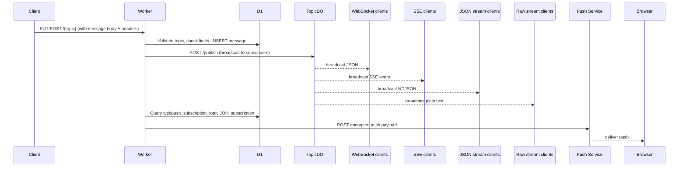

# Architecture

## System Overview

ntfy-cf is a self-hosted, Cloudflare-native clone of the [ntfy](https://ntfy.sh) push notification service. It uses four Cloudflare primitives:

| Component           | Purpose                                                          |
| ------------------- | ---------------------------------------------------------------- |
| **Cloudflare Workers** | HTTP API (Hono framework), request routing, business logic     |
| **Durable Objects**    | Per-topic real-time connection management & message broadcasting |
| **D1 Database**        | Relational persistence for messages, users, subscriptions        |
| **Cloudflare Pages**   | React PWA front-end with service worker and offline support      |

A shared TypeScript package (`packages/shared`) provides types and utilities consumed by both the worker and the web app.

---

## Request Flow

```
                         ┌──────────────────────────┐
                         │   Cloudflare Workers      │
                         │   (Hono HTTP Router)      │
                         │                           │
                         │  /v1/health   ──> health  │
                         │  /v1/config   ──> config  │
                         │  /v1/metrics  ──> metrics │
                         │  /v1/webpush  ──> webpush │
                         │  /v1/account  ──> account │
                         │  /v1/users    ──> admin   │
                         │  /{topic}     ──> topic   │
                         └──────────┬────────────────┘
                                     │
                    ┌────────────────┼──────────────────┐
                    │                │                   │
                    ▼                ▼                   ▼
          ┌─────────────────┐  ┌──────────────┐  ┌──────────────┐
          │  D1 Database     │  │  Durable Obj │  │  Web Push    │
          │  (persistence)   │  │  TopicDO     │  │  (3rd-party  │
          │                  │  │  (real-time) │  │   endpoint)  │
          │  messages        │  │              │  └──────────────┘
          │  users           │  │  WebSocket   │
          │  tokens          │  │  SSE         │
          │  subscriptions   │  │  JSON stream │
          └─────────────────┘  │  Raw stream  │
                                └──────────────┘
```

### Publish Flow



### Subscribe Flow

```
Client ──GET /{topic}/ws──> Worker ──fetch──> TopicDO ──WebSocket upgrade──> Client
Client ──GET /{topic}/sse──> Worker ──fetch──> TopicDO ──text/event-stream──> Client
Client ──GET /{topic}/json─> Worker ──fetch──> TopicDO ──application/x-ndjson─> Client
Client ──GET /{topic}/raw──> Worker ──fetch──> TopicDO ──text/plain──> Client
```

---

## Component Relationships

### Worker (`worker/src/index.ts`)

Uses the **Hono** framework for routing. Registers route modules under `/v1` and `/`:

| Prefix | Routes Module | Mounted At |
| ------ | ------------- | ---------- |
| `/v1`  | `health.ts`   | `/v1/health`, `/v1/stats` |
| `/v1`  | `config.ts`   | `/v1/config`, `/v1/config.js` |
| `/v1`  | `metrics.ts`  | `/v1/metrics` |
| `/v1`  | `webpush.ts`  | `/v1/webpush` |
| `/v1`  | `account.ts`  | `/v1/account` and sub-resources |
| `/v1`  | `admin.ts`    | `/v1/users` and sub-resources |
| `/`    | `topic.ts`    | `/{topic}` and sub-resources |

Global middleware: CORS (all origins), request logging, secure headers.

### Durable Object — TopicDO (`worker/src/do/topic.ts`)

One Durable Object instance per topic name (derived via `TOPIC_DO.idFromName(topic)`).

Responsible for:
- Maintaining a ring buffer of the last 100 messages per topic
- Managing persistent connections: WebSocket, SSE, JSON stream, raw stream
- Broadcasting published messages to all active subscribers
- Sending keepalive pings at a configurable interval (default 30 s)
- Supporting poll-based subscriptions with configurable timeout
- Cleaning up dead connections

### Database Layer (`worker/src/db.ts`)

- `initDatabase()` — called at the start of every request handler; runs schema migration if `schema_version` table is empty
- `getStats()` — returns aggregate message count
- `incrementMessages()` — atomically increments the message counter

### Middleware (`worker/src/middleware.ts`)

Handles:
- **Authentication**: Basic auth (username:password), Bearer token, raw token (`nk...`), query parameter `?auth=`
- **Authorization**: `requireAuth()` / `requireAdmin()` guards
- **Password hashing**: PBKDF2-SHA256 with scrypt-compatible encoding
- **Token generation**: random hex tokens
- **ID generation**: random alphanumeric, sequence IDs

### Web Front-end (`web/`)

React SPA built with Vite, Material UI, and `vite-plugin-pwa` for full PWA support. Features:
- Topic subscription management
- Real-time message display via WebSocket/SSE/JSON stream
- Web Push subscription via the Push API and `webpush` endpoint
- Multi-language support (i18next)
- IndexedDB-based offline storage (Dexie)
- Configurable via `/config.js` — a dynamically generated JS file that populates `window.ntfyConfig`

---

## Data Flow

### Publishing a Message

1. Client sends `PUT` or `POST` to `/{topic}` with plain text body and optional `X-*` headers
2. Worker validates topic format and disallowed topics list
3. Worker enforces daily visitor message limit (if configured)
4. Worker enforces message size limit
5. Worker authenticates the request (optional; anonymous publish permitted)
6. Worker inserts the message into D1 with full metadata
7. Worker increments the global message counter
7. Worker forwards the message to the TopicDO Durable Object for real-time broadcast
8. Worker queries Web Push subscriptions for this topic and delivers encrypted push notifications
9. Returns `201 Created` with the message JSON

### Subscribing to a Topic

1. Client requests `GET /{topic}/{format}` where format is `ws`, `sse`, `json`, or `raw`
2. Worker validates the topic
3. Worker forwards the request to the TopicDO Durable Object
4. TopicDO creates a connection, sends an `open` event, then replays past messages (if `?since=` specified)
5. TopicDO keeps the connection alive with periodic keepalive messages
6. When `?poll=` is specified, connection auto-closes after the timeout

### Web Push Delivery

1. On publish, the worker queries `webpush_subscription_topic` JOIN `webpush_subscription` for subscriptions matching the topic
2. For each subscription, the worker performs RFC 8291 (Web Push Encryption) using ECDH key agreement, HKDF key derivation, and AES-128-GCM encryption
3. Encrypted payloads are POSTed to the browser push service endpoint

---

## Deployment Architecture

```
Internet
    │
    ├── https://ntfy.example.com ──> Cloudflare Workers (API)
    │       │
    │       ├── D1 Database (ntfy-cf-db) — primary data store
    │       └── Durable Objects (TopicDO) — real-time pub/sub
    │
    └── https://ntfy.example.com ──> Cloudflare Pages (Web UI)
            │
            └── Static assets (React SPA, service worker)
```

### Worker Configuration (`wrangler.toml`)

- **Worker name**: `ntfy-cf-api`
- **D1 binding**: `DB` → database `ntfy-cf-db`
- **DO binding**: `TOPIC_DO` → class `TopicDO`
- **Compatibility date**: 2025-04-01 (with `nodejs_compat` flag)
- **Environment variables**: `BASE_URL`, `ENABLE_SIGNUP`, `ENABLE_LOGIN`, `DISALLOWED_TOPICS`, `ACCESS_CONTROL_ALLOW_ORIGIN`, `VISITOR_SUBSCRIPTION_LIMIT`, `VISITOR_MESSAGE_DAILY_LIMIT`, `MESSAGE_SIZE_LIMIT`, `KEEPALIVE_INTERVAL`
- **Secrets** (set via `wrangler secret`): `WEB_PUSH_PUBLIC_KEY`, `WEB_PUSH_PRIVATE_KEY`

### CI/CD Pipeline (`.github/workflows/ci.yml`)

Three jobs run on push/PR to `main`:

1. **test** — `npm ci`, `npm run build`, `npm test` on Node.js 22
2. **deploy-worker** — Uses `wrangler-action` to deploy the Worker (main branch only)
3. **deploy-web** — Builds the web app and deploys to Cloudflare Pages via `wrangler pages deploy web/dist --project-name=ntfy-cf`

### Web Push Keys

VAPID keys for Web Push are stored as secrets and injected at deploy time. The public key is also exposed via `v1/config` and `config.js` for client-side subscription.
